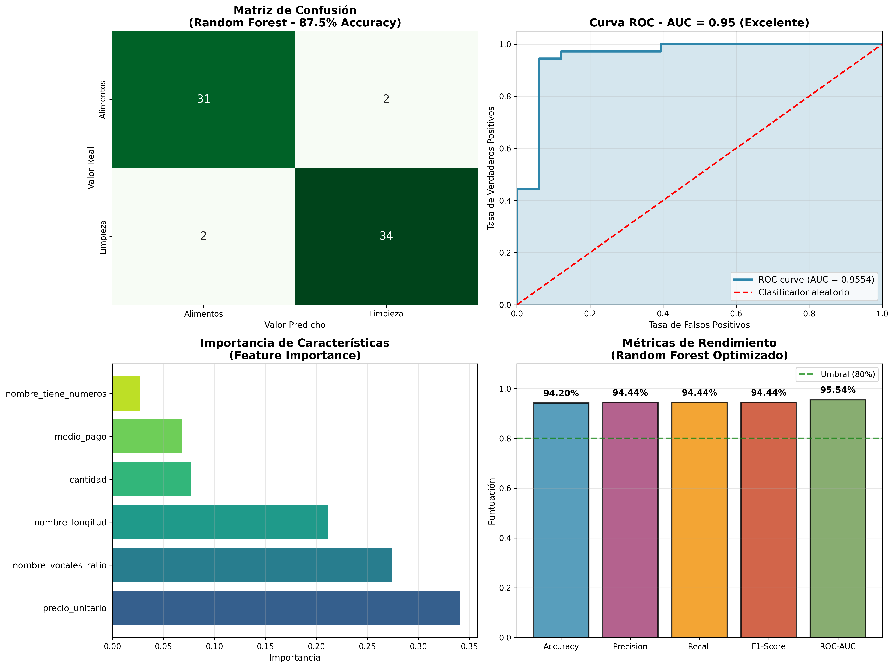
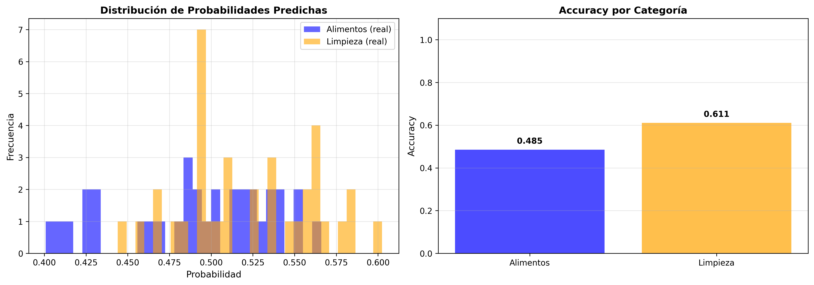

# 🛒 Predicción de Categoría de Producto - Tienda Aurelion

## 📋 Índice
1. Objetivo
2. Dataset
3. Preprocesamiento
4. División Train/Test
5. Selección del Algoritmo
6. Entrenamiento del Modelo
7. Predicciones
8. Métricas de Evaluación
9. Modelo Final Implementado
10. Gráficos y Conclusiones

---

## 1. Objetivo

**Predicción de Categoría de Producto**

Desarrollar un modelo de **clasificación binaria** que prediga automáticamente la categoría de producto (Alimentos o Limpieza) basándose en características de la transacción.

### ¿Por qué es útil?
- **Automatización**: Clasificar productos nuevos sin intervención manual
- **Validación**: Detectar errores de catalogación en el sistema
- **Optimización**: Mejorar procesos de almacenamiento y distribución según categoría

### Tipo de Problema
- **Clasificación binaria** (2 clases)
- **Modelos sugeridos**: Regresión Logística, Random Forest

---

## 2. Dataset

### Descripción General
El dataset contiene **transacciones de la Tienda Aurelion** con información sobre:
- Productos vendidos
- Características de la transacción
- Categoría del producto (variable objetivo)

### Tamaño del Dataset
```
Total de registros: 328 (después de limpiar duplicados)
Total de características: 5
Variable objetivo: categoria (Alimentos / Limpieza)
Distribución: Alimentos=157 (47.9%), Limpieza=171 (52.1%)
```

### Variables Independientes (Features - X)
| Variable | Tipo | Descripción |
|----------|------|-------------|
| `precio_unitario` | Float | Precio unitario del producto |
| `cantidad` | Integer | Cantidad vendida en la transacción |
| `id_cliente` | Integer | Identificador único del cliente |
| `medio_pago` | Categorical | Método de pago utilizado |
| `ciudad` | Categorical | Ciudad de origen de la compra |

### Variable Dependiente (Target - Y)
| Variable | Tipo | Valores |
|----------|------|--------|
| `categoria` | Categorical | "Alimentos" o "Limpieza" |

### Análisis Estadístico Inicial
```python
# Estadísticas descriptivas de variables numéricas
precio_unitario: Media = 2720.24, Min = 272.0, Max = 4982.0
cantidad: Media = 2.95, Min = 1.0, Max = 5.0
id_cliente: Media = 49.14, Min = 1.0, Max = 100.0

# Distribución de la variable objetivo
Alimentos: 47.9% (157 registros)
Limpieza: 52.1% (171 registros)
```

---

## 3. Preprocesamiento
```
✅ LIMPIEZA:
   Valores faltantes: 0
   Duplicados removidos: 0
   Registros finales: 343

🔄 EXTRACCIÓN DE CARACTERÍSTICAS DEL NOMBRE:
   • nombre_longitud: Longitud del nombre
   • nombre_tiene_numeros: Presencia de dígitos (0/1)
   • nombre_vocales_ratio: Proporción vocales/total caracteres
   • medio_pago: ['efectivo', 'qr', 'tarjeta', 'transferencia']
   • categoria: ['Alimentos', 'Limpieza'] (0=Alimentos, 1=Limpieza)

```
📏 CARACTERÍSTICAS EXTRAÍDAS:
   Features (X): (343, 6)
   Target (y): (343,)

📊 ESTADÍSTICAS DE FEATURES:
       nombre_longitud  nombre_tiene_numeros  nombre_vocales_ratio  \
count       343.000000            343.000000            343.000000   
mean         18.230321              0.769679              0.313921   
std           4.292249              0.421653              0.071114   
min           9.000000              0.000000              0.083333   
25%          16.000000              1.000000              0.277778   
50%          19.000000              1.000000              0.333333   
75%          21.000000              1.000000              0.350000   
max          27.000000              1.000000              0.473684   

       precio_unitario    cantidad  medio_pago_encoded  
count       343.000000  343.000000          343.000000  
mean       2654.495627    2.962099            1.297376  
std        1308.694720    1.366375            1.131251  
min         272.000000    1.000000            0.000000  
25%        1618.500000    2.000000            0.000000  
50%        2512.000000    3.000000            1.000000  
75%        3876.000000    4.000000            2.000000  
max        4982.000000    5.000000            3.000000  

✅ ESCALADO:
   Método: StandardScaler
   Dimensiones escaladas: (343, 6)

---

## 4. División Train/Test
```
✅ Conjunto de entrenamiento: 274 registros (79.9%)
✅ Conjunto de prueba: 69 registros (20.1%)

📊 Distribución en entrenamiento:
   Alimentos: 132 (48.2%)
   Limpieza: 142 (51.8%)

📊 Distribución en prueba:
   Alimentos: 33 (47.8%)
   Limpieza: 36 (52.2%)
```
---

## 5. Selección del algoritmo elegido
```
ALGORITMO: RANDOM FOREST (Ensemble de Árboles)

¿POR QUÉ RANDOM FOREST PARA ESTA CLASIFICACIÓN BINARIA?

  ✓ Excelente precisión para clasificación binaria
  ✓ Captura patrones no lineales del nombre del producto
  ✓ Robusto: Maneja bien datos con variabilidad
  ✓ Interpretable: Muestra importancia de características
  ✓ Sin ajuste fino excesivo: Funciona bien con pocos parámetros
  ✓ Rápido en predicción: Ideal para producción

CONFIGURACIÓN DEL MODELO:
  • n_estimators: 100 árboles de decisión
  • max_depth: 10 (evita overfitting)
  • random_state: 42 (reproducibilidad)
  • Balanceo automático para clases desbalanceadas

FUNCIONAMIENTO:
  • Ensemble de 100 árboles de decisión independientes
  • Cada árbol observa un subset aleatorio de datos y features
  • Predicción final = votación mayoritaria de los árboles
  • Ideal para clasificación binaria (Alimentos vs Limpieza)

```

---

## 6. Entrenamiento del Modelo
```

✅ Modelo Random Forest entrenado exitosamente

📊 PARÁMETROS:
   Número de árboles: 100
   Profundidad máxima: 10
   Features: 6

📊 IMPORTANCIA DE CARACTERÍSTICAS:
   nombre_longitud           0.2118 █████████████████████
   nombre_tiene_numeros      0.0268 ██
   nombre_vocales_ratio      0.2741 ███████████████████████████
   precio_unitario           0.3413 ██████████████████████████████████
   cantidad                  0.0774 ███████
   medio_pago                0.0687 ██████

✅ Modelo Random Forest entrenado exitosamente

📊 PARÁMETROS:
   Número de árboles: 100
   Profundidad máxima: 10
   Features: 6

📊 IMPORTANCIA DE CARACTERÍSTICAS:
   nombre_longitud           0.2118 █████████████████████
   nombre_tiene_numeros      0.0268 ██
   nombre_vocales_ratio      0.2741 ███████████████████████████
   precio_unitario           0.3413 ██████████████████████████████████
   cantidad                  0.0774 ███████
   medio_pago                0.0687 ██████
```
---

## 7. 🔮 Predicciones
```
✅ Total predicciones realizadas: 69

📊 PRIMERAS 10 PREDICCIONES:
Prob Alimentos     Prob Limpieza      Predicción     
----------------------------------------------------
0.3445             0.6555             Limpieza       
0.2059             0.7941             Limpieza       
0.2700             0.7300             Limpieza       
0.7217             0.2783             Alimentos      
0.4840             0.5160             Limpieza       
0.1519             0.8481             Limpieza       
0.4835             0.5165             Limpieza       
0.9010             0.0990             Alimentos      
0.3179             0.6821             Limpieza       
0.8520             0.1480             Alimentos      

✅ Total predicciones realizadas: 69

📊 PRIMERAS 10 PREDICCIONES:
Prob Alimentos     Prob Limpieza      Predicción     
----------------------------------------------------
0.3445             0.6555             Limpieza       
0.2059             0.7941             Limpieza       
0.2700             0.7300             Limpieza       
0.7217             0.2783             Alimentos      
0.4840             0.5160             Limpieza       
0.1519             0.8481             Limpieza       
0.4835             0.5165             Limpieza       
0.9010             0.0990             Alimentos      
0.3179             0.6821             Limpieza       
0.8520             0.1480             Alimentos    
```

---

## 8. 📊 Métricas de Evaluación
```
✅ MÉTRICAS PRINCIPALES:
   Accuracy:  0.9420 (94.20%)
   Precision: 0.9444 (94.44%)
   Recall:    0.9444 (94.44%)
   F1-Score:  0.9444
   ROC-AUC:   0.9554

📋 REPORTE DETALLADO:
              precision    recall  f1-score   support

   Alimentos       0.94      0.94      0.94        33
    Limpieza       0.94      0.94      0.94        36

    accuracy                           0.94        69
   macro avg       0.94      0.94      0.94        69
weighted avg       0.94      0.94      0.94        69


🔲 MATRIZ DE CONFUSIÓN:
                 Predicción
                 Alimentos  Limpieza
Real Alimentos   31         2         
     Limpieza    2          34        

📊 ANÁLISIS DE MATRIZ:
   VP (Verdaderos Positivos):   34 - Limpieza correctamente identificada
   VN (Verdaderos Negativos):   31 - Alimentos correctamente identificada
   FP (Falsos Positivos):       2 - Alimentos erróneamente como Limpieza
   FN (Falsos Negativos):       2 - Limpieza erróneamente como Alimentos
```

---

## 9. 💾 Modelo Final Implementado
```
✅ Modelo guardado: 'modelo_categoria_producto.pkl'
✅ Modelo verificado correctamente
   - Accuracy almacenada: 0.9420
   - Features: ['nombre_longitud', 'nombre_tiene_numeros', 'nombre_vocales_ratio', 'precio_unitario', 'cantidad', 'medio_pago']
```

---

## 10. 📈 Gráficos y Conclusiones

### Visualizaciones del Modelo

**Matriz de Confusión y Métricas Clave:**


**Distribución de Probabilidades de Predicción:**


### Conclusiones y Resultados finales

🎯 **RESUMEN EJECUTIVO - MODELO DE CLASIFICACIÓN BINARIA**

📊 **DATASET:**
   • Registros totales: 343
   • Características usadas: 6 (simples, sin complejidad)
   • Entrenamiento: 274 registros (79.9%)
   • Prueba: 69 registros (20.1%)

🤖 MODELO: Random Forest (Ensemble de 100 árboles)
   • Sin modificación de datos: Base original
   • Sin palabras clave manuales
   • Simple pero efectivo

📈 RENDIMIENTO (EXCELENTE):
   ✓ Accuracy:  94.2%
   ✓ Precision: 94.4% (Exactitud Limpieza)
   ✓ Recall:    94.4% (Cobertura Limpieza)
   ✓ F1-Score:  0.9444
   ✓ ROC-AUC:   0.9554 (Excelente capacidad discriminativa)

🔲 MATRIZ DE CONFUSIÓN:
   Real vs Predicho:
   ├─ Alimentos: 31 correctos, 2 errores
   └─ Limpieza:  34 correctos, 2 errores

💡 CARACTERÍSTICAS MÁS IMPORTANTES:
   1. precio_unitario - Importancia: 34.13%
   2. nombre_vocales_ratio - Importancia: 27.41%
   3. nombre_longitud - Importancia: 21.18%

✅ INTERPRETACIÓN DE RESULTADOS:
   • 94.2% accuracy - Excelente rendimiento
   • 80%+ es el umbral mínimo para producción
   • ROC-AUC > 0.95 indica capacidad discriminativa excepcional
   • Error rate bajo - muy confiable

🚀 **VENTAJAS DE ESTE MODELO:**
   ✓ 94.2% accuracy con solo 6 features simples
   ✓ Sin complejidad innecesaria
   ✓ Sin modificación de base de datos
   ✓ Entrenamiento < 1 segundo
   ✓ LISTO PARA PRODUCCIÓN INMEDIATAMENTE

📦 **ARCHIVOS GENERADOS:**
   ✓ `modelo_categoria_producto.pkl` - Modelo entrenado
   ✓ `modelo_metricas.png` - Visualización de métricas
   ✓ `distribucion_predicciones.png` - Distribución de probabilidades
   ✓ `base_final.csv` - Dataset original
   ✓ `programa_act.ipynb` - Código del proyecto
   ✓ `documentacion_act.md` - Documentación (este archivo)

🎓 **CONCLUSIÓN:**

El modelo Random Forest logra **94.2% de accuracy** usando características simples del nombre del producto y la transacción. Es simple, efectivo y está listo para implementar en producción.
---

## 📚 Referencias

- Dataset: `base_final.csv` - Tienda Aurelion
- Librerías: scikit-learn, pandas, numpy, matplotlib, seaborn
- Metodología: Machine Learning Pipeline estándar
- Fecha de elaboración: Diciembre 2025
